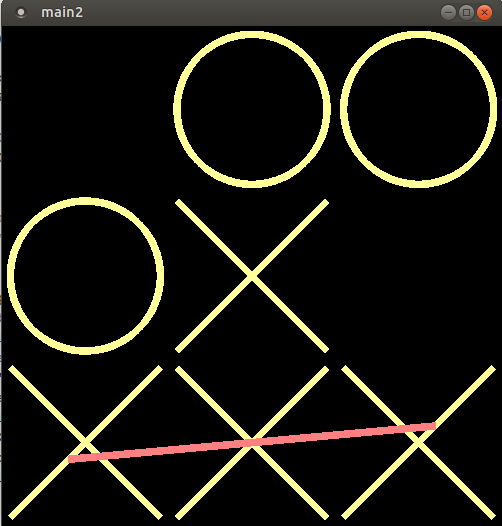

# tic-tac-toe

1. Download and unpack GLFW library from [here](https://www.glfw.org/download.html) to "/path/to/your/glfw_src" folder.
2. Goto tic-tac-toe source folder and edit CMakeList.txt.  
   Replace "/home/sms/Загрузки/glfw-3.3/" with "/path/to/your/glfw_src".
3. Type in terminal:
```
cmake .
make main
./main
```


